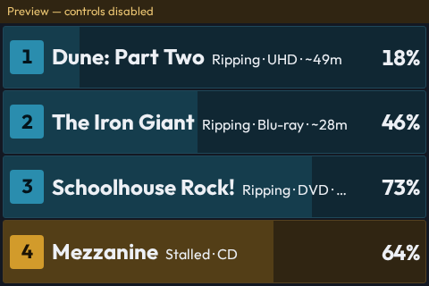
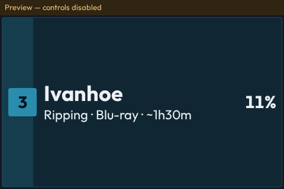
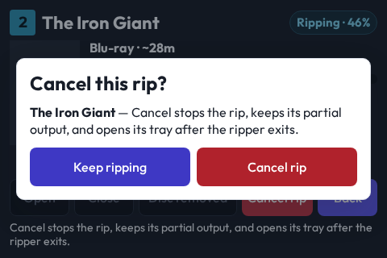

# Tower kiosk

`/kiosk` is Rip Deck's dedicated 480×320 view. It shows only slots that Rip Deck currently owns for active work, in physical order, without an app title or a scrolling card grid. A tray or job transition keeps a non-active slot visible for 12 seconds as feedback; it then leaves the screen. The remaining active rows divide the full height. One to three rows use the largest two-line treatment, four to six use a roomy treatment, and seven to nine retain the compact one-line treatment. When no rip is active, the view says `No rips running` instead of reserving nine empty rows ([decision](decisions/2026-09-23-the-kiosk-focuses-on-active-rips.md)).

Each row is washed in its state's intent color (info while ripping and warning for a slow read or stall), carries the bay number as a solid chip — never the word "Slot" — and puts the percentage at the right edge. There is no bar column: the row's own background is the progress, a translucent wash of its intent color that grows from the left ([decision](decisions/2026-09-10-a-kiosk-row-is-one-line-and-its-background-is-the-progress.md)). The kiosk renders in the fleet's Outfit, like the rest of the app. When no drive answers the daemon's probe (`is_tower_present` false, the daemon's definition of the tower being off) the rows give way to a single "Tower is off" panel, so a switched-off tower does not look like a dead display. A row opens `/kiosk/slots/<drive-id>` with the same chip and title as its heading, the current disc's artwork (when available), type, progress, ETA, outcome, and Open / Close / Disc removed / Back controls. An active rip also has a danger-styled Cancel rip control. It opens an in-page confirmation that says the partial output stays and the tray opens only after the ripper exits. The in-page confirmation is required because the physical CastKit display can return touches to named page targets but cannot answer Chromium's native confirmation dialog.

The color treatment was chosen from three served candidates ([comparison](previews/2026-09-08-rip-deck-kiosk-colour.html), [render](previews/2026-09-08-rip-deck-kiosk-colour.png)); see the [decision](decisions/2026-09-08-a-kiosk-row-is-tinted-by-its-state-and-headlines-the-rip-name.md).

The kiosk uses the normal Rip Deck data source and command endpoints. Preview and disconnected states disable physical controls. Active rips disable tray and removal commands; the daemon independently refuses unsafe commands. Cancel uses the same `POST /api/bay-action` path as the main dashboard. The daemon stops only the selected rip, waits for its ripper to exit, and then opens that bay. Preview data and disconnected states disable Cancel with the other physical controls. `clear_loaded` accepts an optional `drive_id` or `slot` to dismiss exactly one disc. Omitting the target retains the existing whole-tower command. A malformed or unknown target never becomes a bulk clear. Dismissal preserves the bay latch so a drive that still reports the disc does not rip it again.

## CastKit contract

Point CastKit's remote-display worker at **`/kiosk/castkit.json`**. This app-owned, versioned JSON manifest specifies the viewport, initial page, stable touch identity attribute, refresh limits, and the cached loading URL `/kiosk/loading`. CastKit reads those instructions; it owns no Rip Deck view, disc metadata, artwork lookup, or tray commands.

For photographs and demonstrations, **`/kiosk/castkit-showcase.json`** opens the
read-only `showcase` fixture instead. Its nine rows include one empty bay, active,
stalled, successful, successful-with-warnings, and failed states, plus UHD, Blu-ray,
DVD, and CD media. Fixture responses set `is_fake: true`, the display says
`Preview — controls disabled`, and no touch can operate the physical tower. Restore
the normal manifest and restart the CastKit worker after the demonstration.

The loading URL uses the same React application and shared Charcuterie Skeleton component. CastKit renders it once and preloads the bitmap into ESPHome PSRAM. Row bounds from the rendered frame identify where a completed tap should show that cache immediately. The current WT32 receiver supports one optimistic cache image. It does not cache disc-specific progress or command success.

Action identities contain the drive, job, and state. CastKit binds a physical touch to the identity in the acknowledged image and checks that it still matches Chromium before dispatch. Back and slot navigation use stable route identities. A pending command disables its controls, and a server report supplies the result.

The screenshots use fixtures. Missing artwork produces a placeholder; the kiosk does not invent a poster for an unidentified disc.
