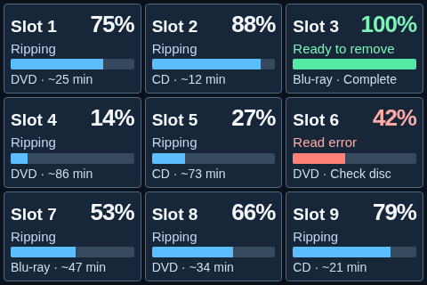
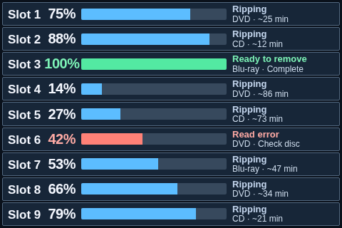

# September 2026 kiosk layout study

These six files are exact copies of the early kiosk mockups from `agentic` commit `506915cc989ee2cbe456467a00cd72e25ee4df05`. Their SHA-256 values matched the source on import. They show the old grid, nine-row, and title-bar options. They are historical design evidence; the current kiosk is implemented in Rip Deck and has later decisions.

The interactive pages are `2026-09-08-rip-deck-kiosk.html`, `2026-09-08-rip-deck-kiosk-grid.html`, `2026-09-08-rip-deck-kiosk-rows.html`, and `2026-09-08-rip-deck-kiosk-before.html`. Open them locally with their sibling files in this folder.

